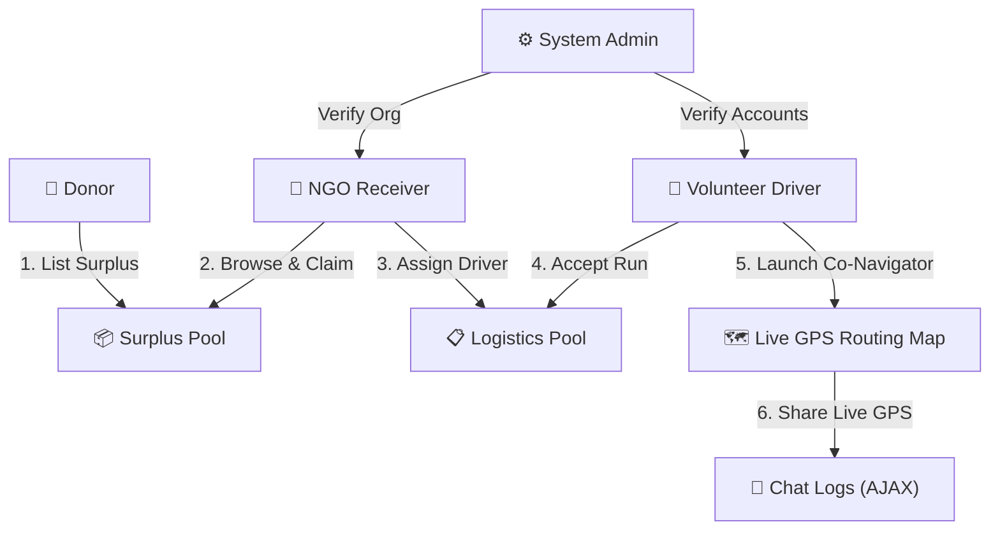
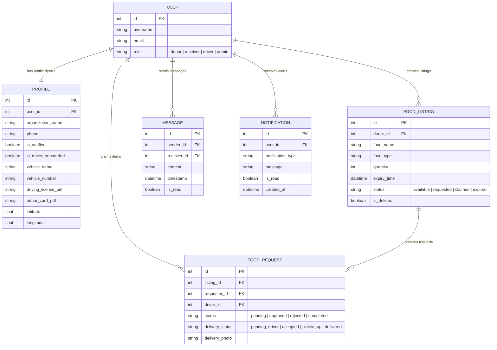

<div align="center">

# 🌱 EcoEats

### Food Waste Redistribution & Live Logistics Routing Platform

*Bridging surplus food from donors to NGOs — powered by real-time GPS-guided volunteer delivery.*

<br/>


</div>

---

## 📖 Overview

**EcoEats** is a state-of-the-art, Django-powered community platform designed to bridge the gap between **food donors** (restaurants, grocers) and **NGO receivers**. The platform features an integrated, real-time logistics dispatch system that coordinates verified volunteer drivers to deliver claimed cargo using live street-by-street map navigation.

<br/>

## 📑 Table of Contents

- [Key System Features](#-key-system-features)
- [System Architecture](#-system-architecture--use-case-flow)
- [Database Schema](#-database-schema-entity-relationship-diagram)
- [Technology Stack](#️-technology-stack)
- [Installation & Setup](#️-installation--running-locally)
- [Test Accounts](#-pre-configured-test-accounts)

---

## 🚀 Key System Features

<table>
<tr>
<td width="50%" valign="top">

### 👤 Donors *(Food Rescue Sources)*
- 📦 List surplus inventory with detailed **volume (kg)**, **expiry times**, and **category tags**
- 🗂️ Manage listings via an interactive inventory dashboard with **Bulk Actions** — select-all toggles to expire or delete listings in one shot
- 🚚 Initiate direct driver delivery coordination requests

</td>
<td width="50%" valign="top">

### 🏢 NGO Receivers *(Food Shelters)*
- 🛒 Browse a **live marketplace** of active surplus food listings
- ✋ Submit requests to claim surplus food items
- 🔔 Receive automatic alerts when new surplus is posted
- 🧭 Assign volunteer drivers to pending pickups via a coordination directory

</td>
</tr>
<tr>
<td width="50%" valign="top">

### 🚛 Volunteer Drivers *(Logistics Partners)*
- 🪪 Dedicated verification onboarding — Aadhar docs, license verification, vehicle parameters
- 🗺️ **Active Job Route Worksheet** tracing pickup → drop-off
- 📍 **Live Co-Navigator (Google Maps-style)** — GPS auto-pan via `navigator.geolocation.watchPosition`, close-up `zoom: 17`, true driving roads via OSRM (no straight-line polylines)
- 📤 **One-Click Location Sharing** directly into donor/receiver chat threads

</td>
<td width="50%" valign="top">

### ⚙️ System Administrators *(Moderators)*
- ✅ Audit and approve driver credentials
- ✅ Verify NGO organization paperwork
- 🛡️ Moderate listings and review system logs

</td>
</tr>
</table>

---

## 📊 System Architecture & Use Case Flow



---

## 💾 Database Schema (Entity Relationship Diagram)



---

## 🛠️ Technology Stack

<div align="center">

| Layer | Technology |
|:---|:---|
| **Backend** |   |
| **Database** |  |
| **Map Engine** |  |
| **Routing API** | -4A90D9?logo=openstreetmap&logoColor=white&style=flat-square) |
| **Styling & UI** | Tailwind-accented Custom HSL Vanilla CSS · Google Fonts *Outfit* & *Inter* · Glassmorphic components · Dynamic transitions |

</div>

---

## ⚙️ Installation & Running Locally

**1. Clone the Repository**
```bash
git clone <repository-url>
cd ECO_EATS
```

**2. Create and Activate a Virtual Environment**
```bash
python -m venv .venv

# Windows
.venv\Scripts\activate

# macOS / Linux
source .venv/bin/activate
```

**3. Install Dependencies**
```bash
pip install -r requirements.txt
```

**4. Perform Database Migrations**
```bash
python manage.py migrate
```

**5. Start the Local Development Server**
```bash
python manage.py runserver
```

Then open **[http://127.0.0.1:8000](http://127.0.0.1:8000)** in your browser. 🎉

---

## 🔐 Pre-configured Test Accounts

> For validation and testing convenience, the following credentials are pre-seeded in the local database.

<div align="center">

| Role | Username | Password | Testing Scope |
|:---:|:---:|:---:|:---|
| ⚙️ **System Admin** | `admin` | `admin123` | Moderate requests, verify driver credentials and NGO paperwork |
| 📦 **Donor** | `donor` | `donor123` | List food surplus, bulk inventory management, direct logistics requests |
| 🏢 **NGO Receiver** | `ngo` | `ngo123` | Browse listings, request surplus, notifications, coordinate drivers |
| 🚚 **Volunteer Driver** | `driver` | `driver123` | Onboard license details, manage worksheets, run Live GPS Co-Navigator |

</div>

> ⚠️ **Note:** These credentials are for local development/testing only. Never use default test accounts in a production deployment.

---

<div align="center">

Made with 💚 for reducing food waste, one delivery at a time.

</div>
