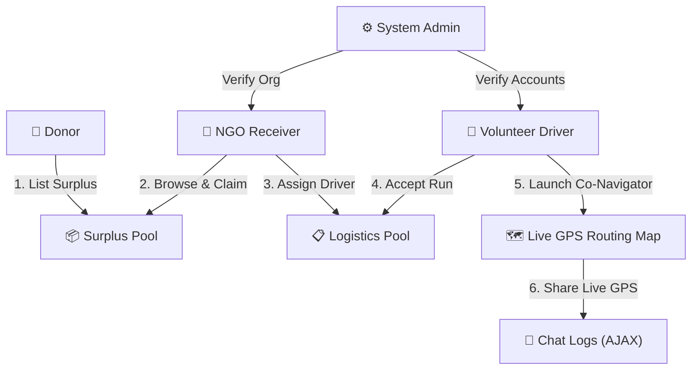
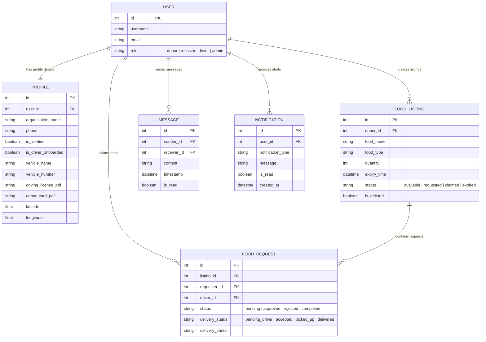

# 🌱 EcoEats - Food Waste Redistribution & Live Logistics Routing

EcoEats is a state-of-the-art, Django-powered community platform designed to bridge the gap between food donors (restaurants, grocers) and NGO receivers. The platform features an integrated, real-time logistics dispatch system that coordinates verified volunteer drivers to deliver claimed cargo using live street-by-street map navigation.

---

## 🚀 Key System Features

### 👤 Role-Based Portals & Workflows

1.  **Donors (Food Rescue Sources)**
    *   List surplus inventory with detailed volume (kg), expiry times, and category tags.
    *   Manage listings via an interactive inventory dashboard featuring **Bulk Actions** (select-all toggles to expire or delete listings in a single action).
    *   Initiate direct driver delivery coordination requests.
2.  **NGO Receivers (Food Shelters)**
    *   Browse a live marketplace of active surplus food listings.
    *   Submit requests to claim surplus food items.
    *   Receive automatic alerts (Notifications) when new surplus items are posted.
    *   Assign volunteer drivers to pending pickups via a coordination directory.
3.  **Volunteer Drivers (Logistics Partners)**
    *   Dedicated verification onboarding (Aadhar documentation, license verification, vehicle parameters).
    *   Active Job Route Worksheet map tracing routes from pickup sources to drop-offs.
    *   **Live Co-Navigator (Google Maps-Style):** Uses device GPS tracking (`navigator.geolocation.watchPosition`) to auto-pan and guide drivers close-up (`zoom: 17`). Calculates true driving roads via OpenStreetMap (OSRM) instead of drawing straight polylines.
    *   **One-Click Location Sharing:** Post active driving coordinates directly to the assigned donor and receiver chat threads.
4.  **System Administrators (Moderators)**
    *   Audit and approve driver credentials and NGO organization verification paperwork.
    *   Moderate listings and view system logs.

---

## 📊 System Architecture & Use Case Flow



---

## 💾 Database Schema (Entity Relationship Diagram)



---

## 🛠️ Technology Stack

*   **Backend:** Python 3.13 / Django 5.x
*   **Database:** SQLite3
*   **Frontend Map Engine:** Leaflet JS (Version 1.9.4)
*   **Routing API:** Leaflet Routing Machine (Version 3.2.12) via OpenStreetMap (OSRM)
*   **Styling & UI:** Tailwind-accented Custom HSL Vanilla CSS (featuring Google Fonts *Outfit* & *Inter*, glassmorphic components, and dynamic transitions).

---

## ⚙️ Installation & Running Locally

1.  **Clone the Repository:**
    ```bash
    git clone <repository-url>
    cd ECO_EATS
    ```

2.  **Create and Activate a Virtual Environment:**
    ```bash
    python -m venv .venv
    # Windows:
    .venv\Scripts\activate
    # macOS/Linux:
    source .venv/bin/activate
    ```

3.  **Install Dependencies:**
    ```bash
    pip install -r requirements.txt
    ```

4.  **Perform Database Migrations:**
    ```bash
    python manage.py migrate
    ```

5.  **Start the Local Development Server:**
    ```bash
    python manage.py runserver
    ```
    Open `http://127.0.0.1:8000` in your web browser.

---

## 🔐 Pre-configured Test Accounts

For validation and testing convenience, the following pre-configured user credentials are available in the local database:

| User Role | Username | Password | Purpose / Testing Scope |
| :--- | :--- | :--- | :--- |
| **System Admin** | `admin` | `admin123` | Moderate requests, verify driver credentials and NGO paperwork. |
| **Donor** | `donor` | `donor123` | List food surplus, use bulk inventory management, coordinates direct logistics request. |
| **NGO Receiver**| `ngo` | `ngo123` | Browse listings, request surplus, check notifications, coordinate volunteer drivers. |
| **Volunteer Driver**| `driver` | `driver123`| Onboard license details, manage worksheets, run Live GPS Co-Navigator. |
